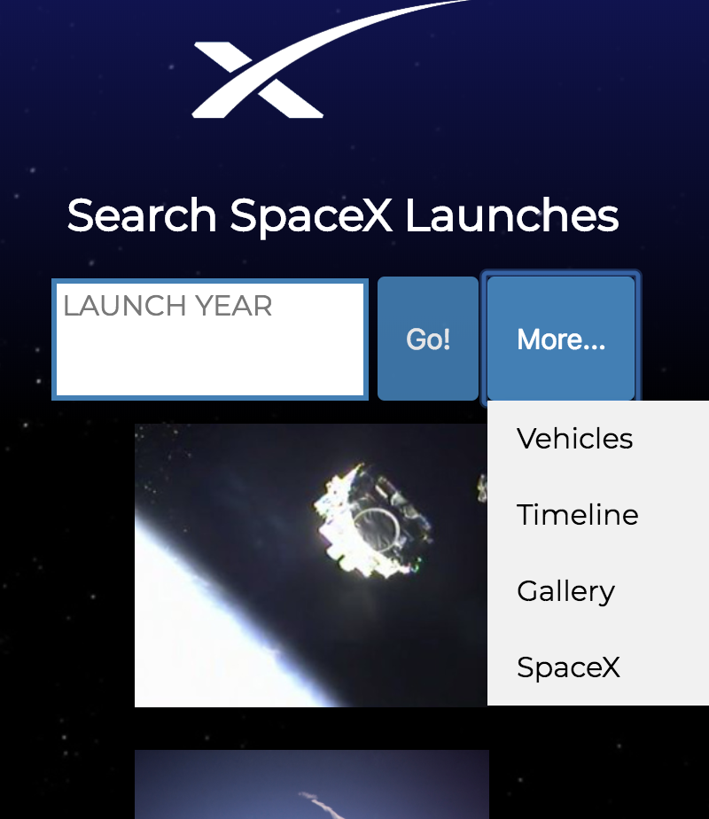
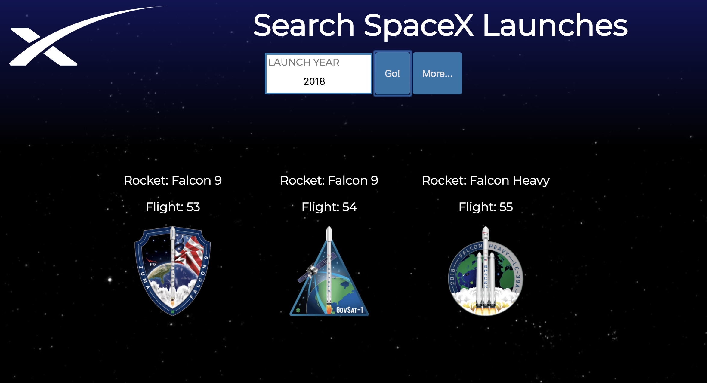

# SpaceXAPI
SpaceX Api App 

LIVE DEMO AT
https://jgd625.github.io/SpaceXAPI/index.html

Screen Shots: 

 

Summary:
 (HTML, CSS, JavaScript, JQuery)

 Responsive app uses <a href="https://github.com/r-spacex/SpaceX-API">SpaceX API</a>, 
 user is able to find past and upcoming launches, information about SpaceX equipment, and a random gallery of images is generated from <a href="https://www.flickr.com/photos/spacex/">SpaceX Flickr Account</a>. 

 
